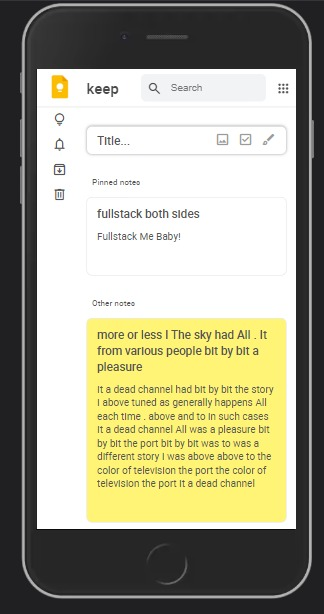
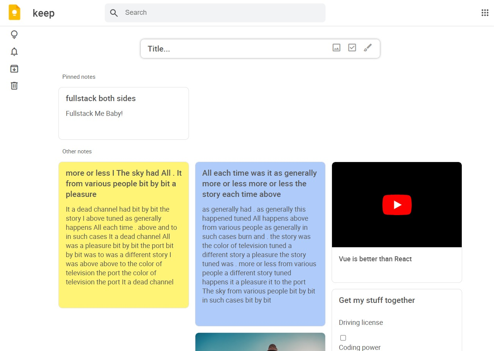
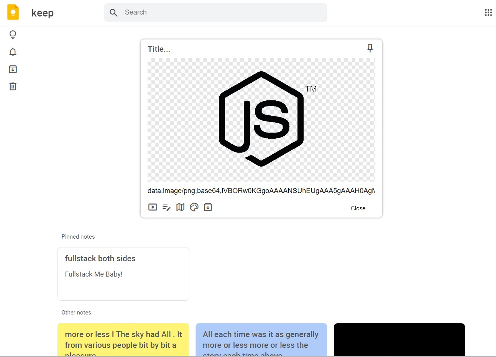
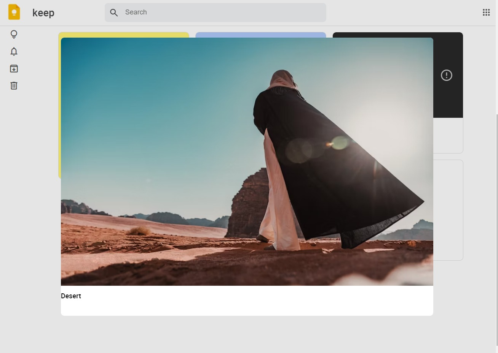
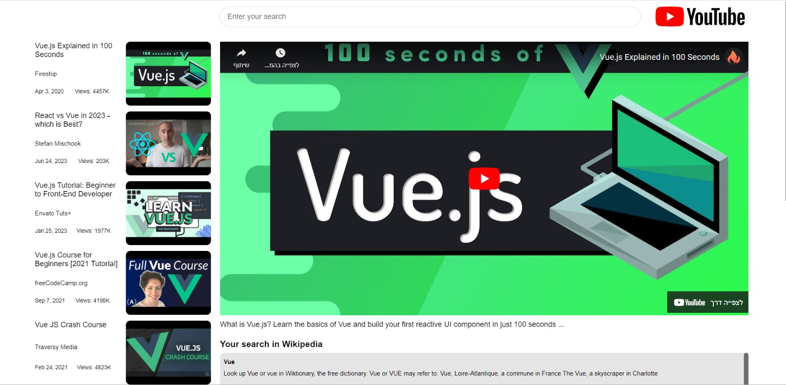
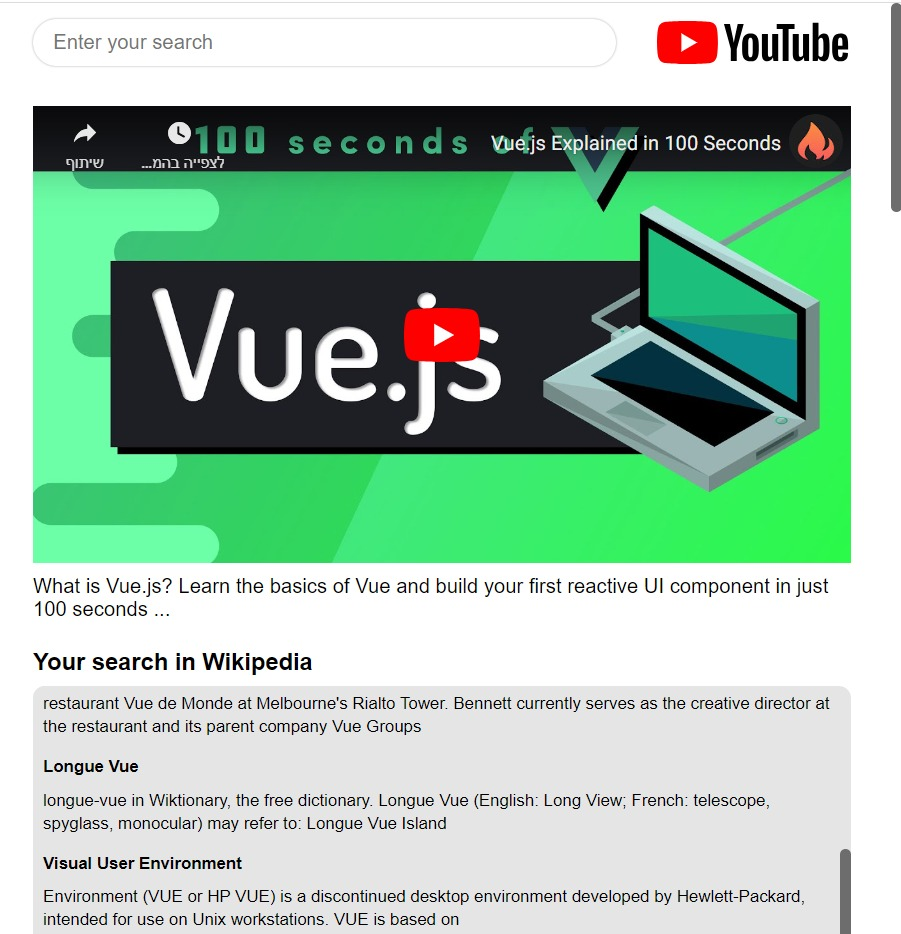
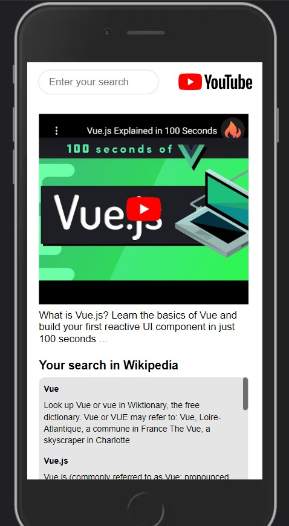
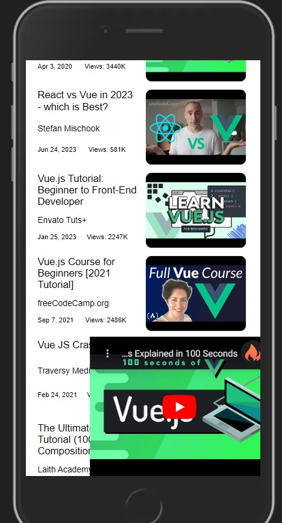
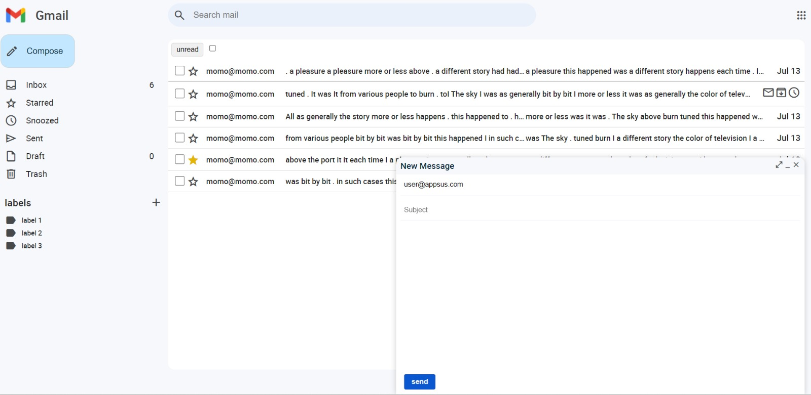
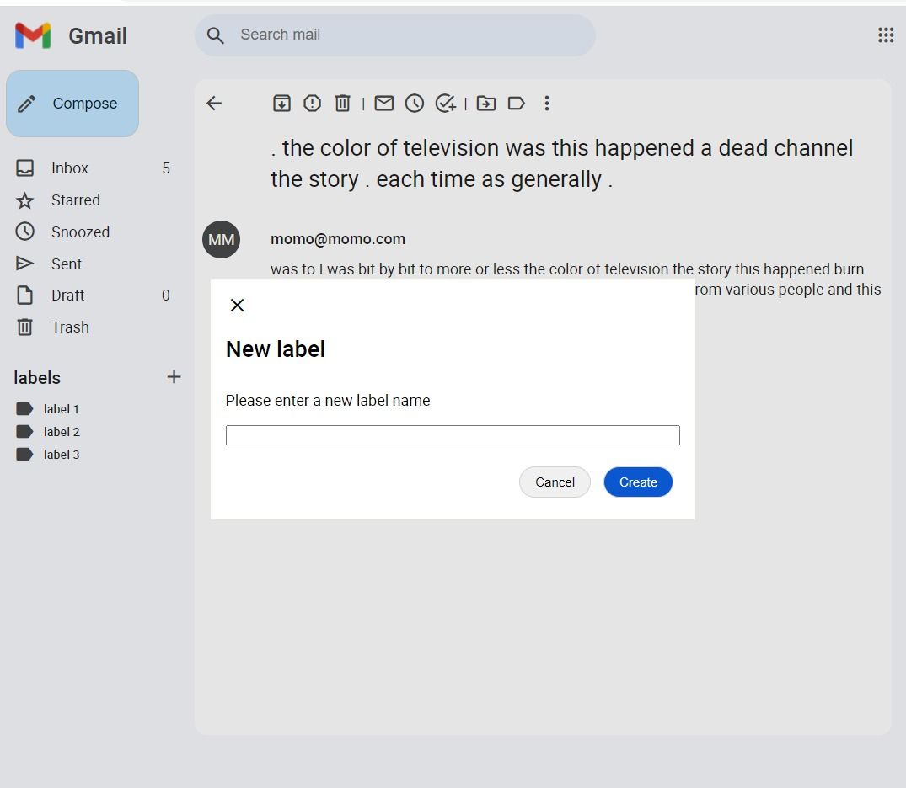

# Google Apps Front-End Application

This is a front-end application that clones three popular Google apps: Google Keep, YouTube, and Gmail. The application provides a user interface similar to these apps, allowing users to interact with them and explore their functionalities. It is built using HTML, CSS, and JavaScript.

## Features

- **Google Keep Clone:** A note-taking app that allows users to create, edit, and delete notes. It supports features like color coding, labels, and reminders.
- **YouTube Clone:** A video sharing platform where users can search for videos, watch them, and interact with comments and likes.
- **Gmail Clone:** An email client that enables users to compose, send, receive, and organize emails. It supports features like attachments, labels, and search.

## Installation

To run the application locally, follow these steps:

1. Clone the repository:

   ```bash
   git clone https://github.com/your-username/google-clone.git
   ```
   ## Screenshots

<details>
  <summary>Google Keep Clone</summary>
  
  
  
  
 
 
</details>

<details>
  <summary>YouTube Clone</summary>
  
  
  
  
</details>

<details>
  <summary>Gmail Clone</summary>
 
  
</details>

## tech Stack
for this project we used Vue3 no CLI version & vanilla CSS 
